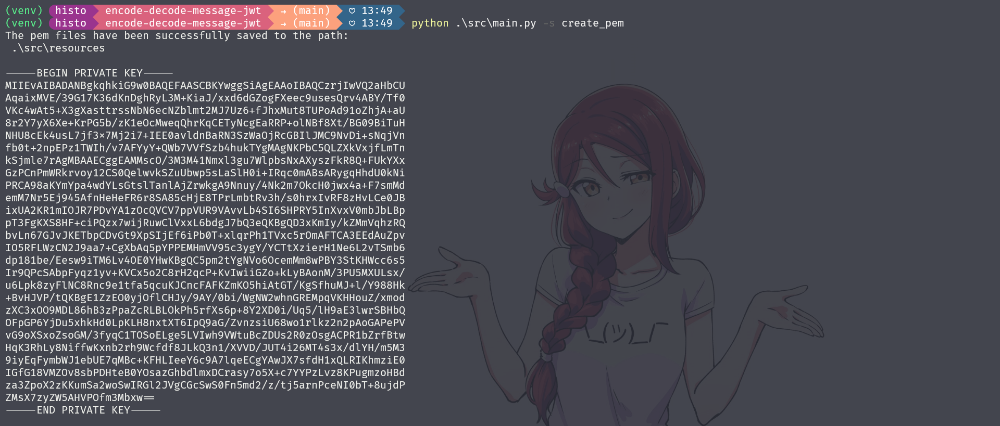

# Generador de archivos PEM con RSA Keys y JWT

Este software o herramienta de terminal facilita la gestión de claves RSA, tanto públicas
como privadas, a través de la creación y lectura de archivos PEM. Además, ofrece funcionalidades
para la codificación de mensajes en formato JSON y la decodificación de mensajes en formato JWT.




## Recomendación Importante
≧◠‿◠≦

Este software genera archivos PEM con claves RSA, las cuales son un componente
crucial de la seguridad en la criptografía. Es esencial tratar estas claves con la máxima
seguridad y precaución.  
No deben ser compartidas ni expuestas bajo ninguna circunstancia. Si se sospecha que una clave
privada ha sido comprometida, debe ser reemplazada inmediatamente. Recuerda siempre seguir
las mejores prácticas de seguridad al manejar claves RSA.


## Configuración de desarrollo
 ≧◠‿◠≦

### Requisitos previos

* Manejo de terminal y línea de comandos.
* Install [Python](https://www.python.org/) which includes [PIP](https://pypi.org/project/pip/)


### Instalación

Clone the repository:

```
git clone https://github.com/miniscandal/encode-decode-message-jwt.git
cd .\whos-that-pokemon\
```

Install project dependencies:

```
pip install -r requirements.txt`
```

Run application:

```
.\venv\Scripts\activate
```


### Lista de comandos

```
python .\src\main.py -s create_pem
python .\src\main.py -s read_pem
python .\src\main.py -s message_encode
python .\src\main.py -s message_decode
```


## Documentación 
 ≧◠‿◠≦


### Tecnologías utilizadas


### Referencias

* [Python](https://www.python.org/)


## Reflexiones y Aprendizajes

≧◠‿◠≦


Durante el desarrollo de esta herramienta de terminal, tuve la oportunidad de perfeccionar y expandir
mis habilidades en varias áreas clave.


Implementación de un entorno virtual aislado para evitar conflictos  
de dependencias y prevenir la contaminación del sistema.

Trabajé para mejorar significativamente la estructura del proyecto, lógica de
negocio y las funcionalidades, lo que aumentó la organización del código y facilitó la
navegación y la comprensión del flujo del programa.

Este software se diseñó como una respuesta a la necesidad de realizar pruebas en un proyecto
independiente, construido con JAVA y Spring Boot, que requería la autenticación de usuarios
mediante JWT. Esta solución ha mejorado significativamente la experiencia y la productividad
del desarrollador de software, optimizando el flujo de trabajo y aumentando la eficiencia.

En conclusión, este proyecto ha sido una experiencia invaluable para no solo profundizar
en mis habilidades técnicas existentes, sino también para explorar y adquirir nuevas
competencias en el desarrollo de software orientado a la terminal o línea de comandos.

Las habilidades recién adquiridas y perfeccionadas me preparan para enfrentar con
eficacia los desafíos futuros de desarrollo. Estas habilidades serán fundamentales para abordar
futuros desafíos de desarrollo en herramientas de terminal.


## Créditos

Este proyecto utiliza las siguientes bibliotecas de código abierto:

- PyJWT: Una biblioteca de Python para codificar y decodificar JWT.
Desarrollado y mantenido por José Padilla y otros contribuyentes.

Agradecemos a los autores de estas bibliotecas por su trabajo y contribución a la comunidad de
software libre.


## Licencia

≧◠‿◠≦

Este proyecto está bajo la Licencia MIT - mira el archivo LICENSE para detalles.
